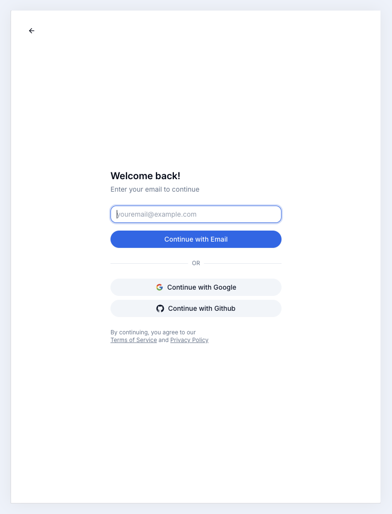
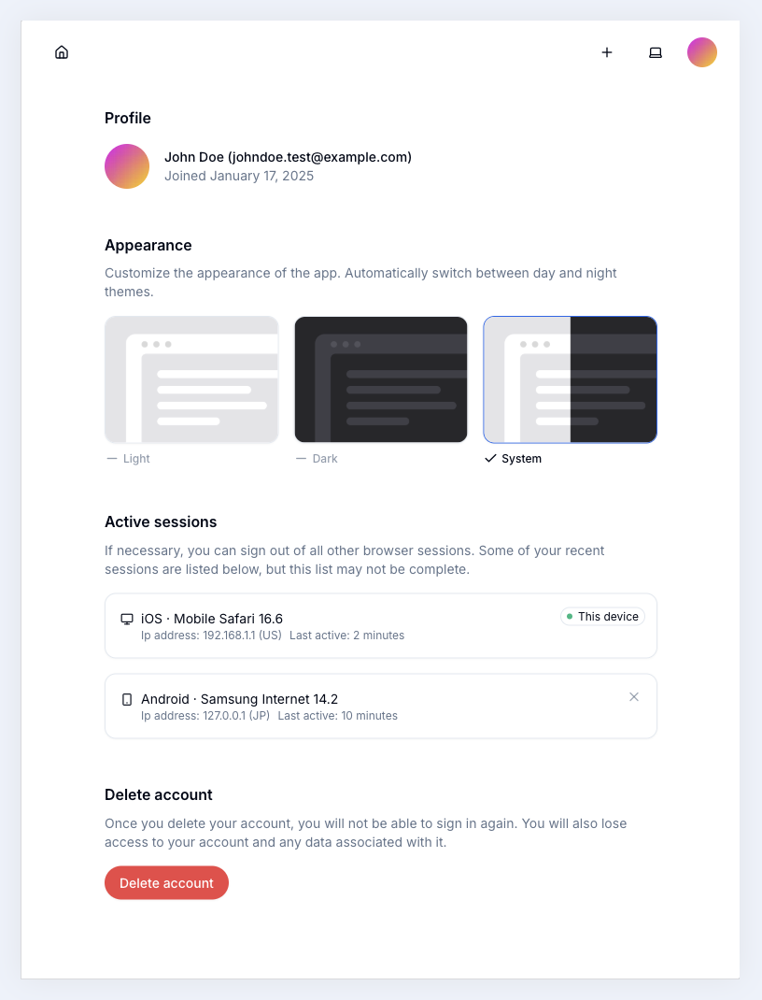

# React Router v7 with Remix Auth Starter Kit

An introductory starter kit for building applications with React Router v7 (Remix) and Remix Auth, designed to run seamlessly on Cloudflare Workers.

## Features
- 🔐 **TOTP, Google, and GitHub Login**  
  Supports TOTP authentication, Google login, and GitHub login. TOTP is integrated with Resend for secure email-based verification.

- 🔑 **KV-Based Authentication and Rate Limiting**  
  Efficient session management and rate limiting using Cloudflare KV.

- 🛢️ **Drizzle ORM + Cloudflare D1**  
  Seamless database integration with Drizzle ORM and Cloudflare D1.

- 🌗 **Dynamic Color Schemes**  
  Supports theme customization with color scheme switching.

- 🎨 **TailwindCSS + Shadcn UI**  
  Modern and customizable UI styling with TailwindCSS and Shadcn components.

- 🧪 **Biome.js for Code Quality**  
  Ensures high-quality code with integrated linting and formatting.

- 🚀 **Cloudflare Workers-Ready**  
  Optimized for deployment on Cloudflare Workers.

## Demo

Here’s a preview of the app:

<div style="display: flex;">
  
  
</div>

For more demo images, check the **.assets** directory.


## Links

More from the React Router v7 Series:
- [React Router v7 with Better Auth](https://github.com/foxlau/react-router-v7-better-auth) - Authentication demo using Better Auth package.
- [React Router v7 Cloudflare workers template](https://github.com/foxlau/react-router-v7-cloudflare-workers) - React Router v7 Cloudflare workers template.

## Getting Started

### Installation

Git clone the repository:

```bash
git clone https://github.com/foxlau/react-router-v7-remix-auth.git
```

Install the dependencies:

```bash
npm install
```

### Development

Run an initial database migration:

```bash
npm run db:apply
```

If you modify the Drizzle ORM schema, please run `npm run db:generate` first. If you need to delete the generated SQL migrations, execute `npm run db:drop` and select the SQL migration you wish to remove.

Start the development server with HMR:

```bash
npm run dev
```

Your application will be available at `http://localhost:5173`.

## Building for Production

Create a production build:

```bash
npm run build
```

## Deployment

Deployment is done using the Wrangler CLI.

```bash
npx wrangler d1 create rr7-remix-auth
npx wrangler kv namespace create APP_KV
```

To deploy directly to production:

```sh
npm run db:apply-prod
npm run deploy
```

To deploy a preview URL:

```sh
npm run deploy:version
```

You can then promote a version to production after verification or roll it out progressively.

```sh
npm run deploy:promote
```

## Questions

If you have any questions, please open an issue.